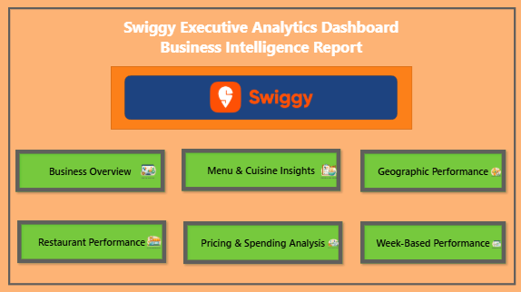
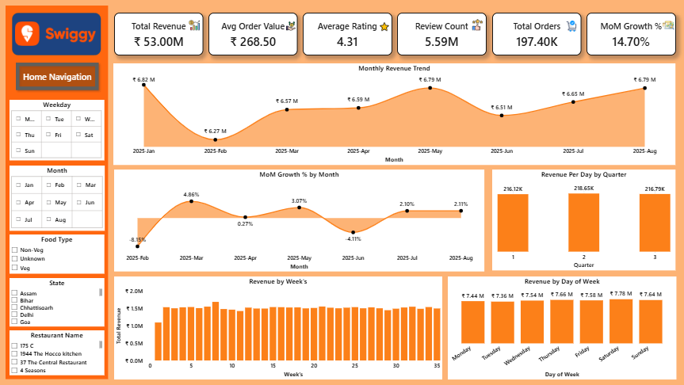
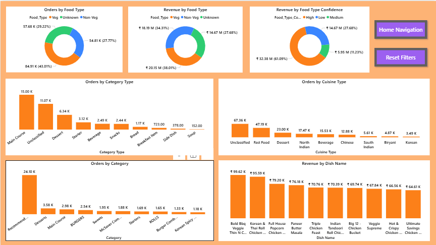
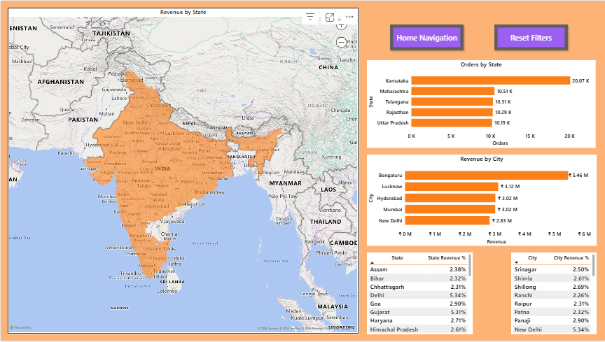
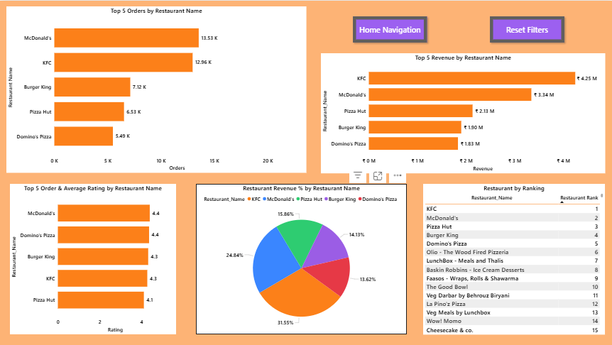
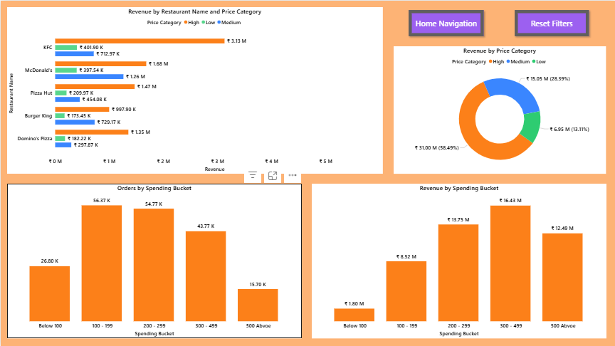
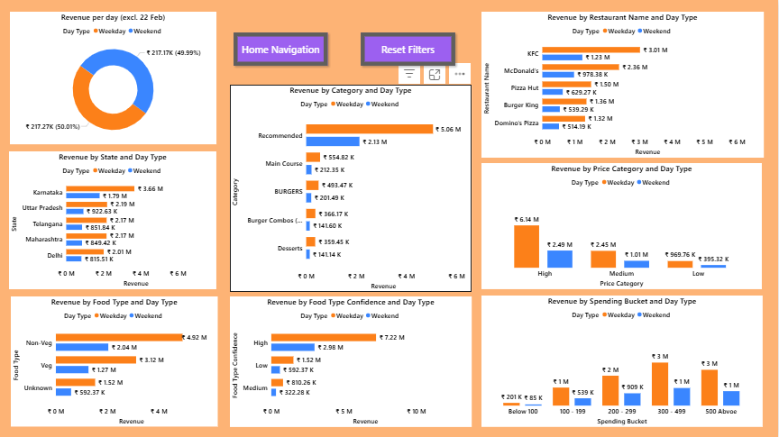

# Swiggy Sales Analysis (Jan to Aug 2025)

An end-to-end analytics project on Swiggy food-delivery data: cleaning and modelling in **SQL Server**, an independent check and EDA in **Python**, and a six-page **Power BI** dashboard.




---

## What this project does

1. **Audits** the raw file and decides how to treat each problem (duplicates, fake default ratings, one odd day).
2. **Cleans and models** the data in SQL Server (staging table, star schema, one flat view for reporting).
3. **Re-does the cleaning in pandas** and checks the results against the SQL numbers.
4. **Explores** time patterns, cities, restaurants, prices and ratings.
5. **Reports** the results in a Power BI dashboard.

---

## Headline numbers

| Metric | Value |
|---|---|
| Order records (after removing 29 duplicates) | 197,401 |
| Sales value (sum of item prices) | INR 5.30 Cr (53.00 M) |
| Average / median item price | INR 268.50 / 229 |
| Period | 1 Jan to 31 Aug 2025 (243 days) |
| States / cities | 28 / 28 |
| Records with at least one review | 59.9% |
| Average rating (reviewed items) | 4.31 simple, 4.36 weighted by review count |

> **Terms.** The file has no order id, so one row is one dish line item (an "order record"). "Sales value" is the sum of item prices. It is **not** Swiggy's revenue.

---

## Key findings

- **Sales are flat over time.** Sales value per day stays between INR 212K and 220K in every month. February's 8.1% drop in total is mostly a shorter month (about 1.8% lower per day).
- **No weekday/weekend effect.** INR 217,271 per weekday vs INR 217,171 per weekend day.
- **Bengaluru leads** with 10.3% of sales value, about 1.8x the order records of the next city.
- **A few brands dominate.** The top 5 restaurants make up 25.4% of sales value (KFC alone 8.0%).
- **Few expensive items, large share of value.** Items of INR 500 or more are 8.0% of records but 23.6% of sales value.
- **Ratings are patchy.** 40% of records have no reviews, and price and rating are almost unrelated (correlation 0.03).
- **22 Feb 2025 is an anomaly.** Bengaluru has about 10x its usual volume that day while other cities are normal. I flag the day and leave it out of per-day figures.

---

## Dashboard

| | |
|---|---|
|  |  |
| Business overview | Menu and cuisine insights |
|  |  |
| Geographic performance | Restaurant performance |
|  |  |
| Pricing and spending | Week-based performance |

---

## Tools

- **SQL Server 2017+**: cleaning, star schema, KPI queries
- **Python 3** (pandas, numpy, matplotlib): reconciliation and EDA
- **Power BI Desktop**: dashboard

---

## Repository structure

```
swiggy-sales-analysis/
├── README.md
├── data/
│   ├── raw/Swiggy_Data.csv          # original file (add it yourself, see "Data")
│   └── analytics/                   # created by the notebook
├── sql/
│   ├── 00_setup_and_import.sql
│   ├── 01_data_cleaning.sql
│   ├── 02_dimension_tables.sql
│   ├── 03_fact_table.sql
│   ├── 04_kpi_analysis.sql
│   └── 05_analytics_view.sql
├── notebooks/
│   ├── 01_data_audit.ipynb
│   └── swiggy_analysis.ipynb               # cleaning, EDA and forecast check
├── FINAL_REPORT.md
├── powerbi/swiggy_2025_dashborad.pbix      # put the .pbix file here
├── images/                                 # dashboard screenshots
├── figures/                                # charts saved by the notebook
└── docs/
    └── sql_expected_results.md             # numbers each SQL script should produce
```

---

## Installation

Clone the repository

[Click here for Git Clone](link)

Install dependencies

pip install -r requirements.txt

Run forecasting script

python src/

---

## Dataset

`Swiggy_Data.csv` has 197,430 rows and 10 columns: State, City, Order_Date, Restaurant_Name, Location, Category, Dish_Name, Price_INR, Rating, Rating_Count.

An earlier version of this project used a file with extra Sep to Dec rows. The audit notebook showed those rows were generated artificially, so they are **not used** anywhere here.

The dataset contains food delivery order data including:

* Order Date
* Restaurant Name
* City
* State
* Cuisine Type
* Food Category
* Order Price
* Customer Rating

⚠️ Due to GitHub file size limits, the dataset is hosted externally.

Download dataset here:

[Click here for Dataset Download](link)

After downloading place files inside:

data/raw/

data/analytics/

---

## Cleaning decisions

| Problem found | What I did |
|---|---|
| 6,655 dish names with extra spaces | Trimmed all text columns |
| 29 exact duplicate rows (ignoring case) | Removed, 197,430 to 197,401 |
| 79,080 rows with zero reviews, most showing a default rating of 4.4 | Set Rating to NULL, added a `Rating_Status` column |
| No natural price tiers | Low / Medium / High from terciles (INR 169 and 290) |
| 22 Feb 2025 has about twice the normal rows | Flagged with `Is_Anomaly_Day`, kept, left out of per-day figures |
| Veg / Non-Veg and cuisine missing | Keyword rules in SQL, with a confidence level. A large share stays Unclassified |

---

## Data model

A star schema built in SQL Server:

- **Fact:** `fact_swiggy_orders` (one row per record, surrogate `order_id`)
- **Dimensions:** `dim_date`, `dim_location`, `dim_restaurant`, `dim_category`, `dim_dish`
- **View:** `vw_swiggy_analytics` joins everything into one flat table for Power BI and Python

---

## How to run

**1. SQL**

1. Open `sql/00_setup_and_import.sql` and change the CSV path to where your file is.
2. Run the scripts `00` to `05` in order.
3. After each script, compare the check queries it prints with `docs/sql_expected_results.md`.

**2. Python**

```bash
pip install pandas numpy matplotlib jupyter
jupyter notebook notebooks/swiggy_analysis.ipynb
```

Run all cells. The notebook reads `data/raw/Swiggy_Data.csv`, saves charts to `figures/`, and writes `swiggy_clean_python.csv` and `daily_sales.csv` to `data/analytics/`. It has 15 reconciliation checks against the SQL results near the top, and the forecast check at the end.

**3. Power BI**

Open the `swiggy_2025_dashborad.pbix` file in `powerbi/`, or connect Power BI to `vw_swiggy_analytics` in SQL Server.

---

## Limitations

- **Eight months only.** No full year, so nothing about yearly seasonality or Q4.
- **A row is a dish line item**, not a verified order.
- **Ratings are item-level** and 40% are missing, so rating results describe reviewed items only.
- **Descriptive only.** These are patterns in one dataset, not causes.
- **Veg/Non-Veg and cuisine labels** are approximate (keyword rules).

---

## Forecasting

Section 11 of `swiggy_analysis.ipynb` runs a rolling-origin backtest (30-day horizon) of simple baselines on `data/analytics/daily_sales.csv`: naive, mean of history, moving averages, seasonal naive and a weekday profile. I only use simple baselines because the daily series is flat with no weekday effect, so a complex model has little to learn. It runs together with the rest of the notebook and writes `forecast_summary.md` to `data/analytics/` and a chart to `figures/`.

---

# Forecast Data

Forecast output files are too large for GitHub.

Download here:

[Click here for Forecast Results](link)

Place them in:

```
forecasts/
```

---

## Final report

See [`FINAL_REPORT.md`](FINAL_REPORT.md) for the full write-up.

---

# Author

**Jaskar Jeyabalan S**

Email: [jaskarjeyabalan@gmail.com](mailto:jaskarjeyabalan@gmail.com)

---

# License

This project is licensed under the MIT License.
